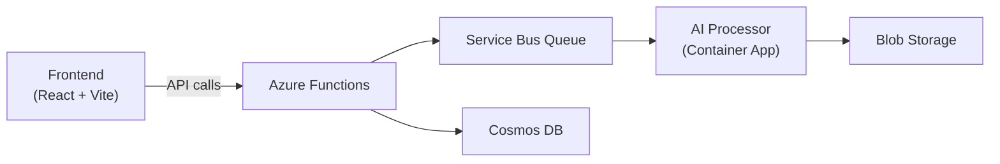

# 🎵 Audio Cleaner Web

AI-powered video noise reduction in the cloud. Upload a video and receive a version with crystal-clear audio using state-of-the-art DeepFilterNet3.

## Table of Contents

- [🎵 Audio Cleaner Web](#-audio-cleaner-web)
  - [Table of Contents](#table-of-contents)
  - [Features](#features)
  - [Prerequisites](#prerequisites)
  - [Project Structure](#project-structure)
  - [Architecture](#architecture)
  - [Installation \& Local Development](#installation--local-development)
  - [Configuration](#configuration)
  - [Usage](#usage)
  - [Deployment](#deployment)
    - [Deployment Prerequisites](#deployment-prerequisites)
    - [Build and Deploy Steps](#build-and-deploy-steps)
    - [Deployment Configuration](#deployment-configuration)
    - [Quick Deployment (Alternative)](#quick-deployment-alternative)
  - [Troubleshooting \& Tips](#troubleshooting--tips)
  - [Contributing](#contributing)
  - [License](#license)

## Features

- Noise reduction for any video format via DeepFilterNet3 AI model
- Secure direct-to-blob uploads/downloads with time-limited SAS tokens
- Serverless API (Azure Functions) and queue-based processing (Service Bus)
- GitHub OAuth authentication and Stripe subscription management
- Automatic cleanup of old files and cost-efficient scaling to zero

## Prerequisites

- Node.js (>=14.x) and npm
- Azure Static Web Apps CLI (`npm install -g @azure/static-web-apps-cli`)
- Azure Functions Core Tools (`npm install -g azure-functions-core-tools@4`)
- Docker (for local AI processor)
- Terraform (for infrastructure provisioning)

## Project Structure

```text
Audio-Cleaner-Web/
├── frontend/          # React + Vite UI
├── api/               # Azure Functions (Node.js)
│   ├── upload-file/   # Generate upload SAS URL
│   ├── enqueue-job/   # Enqueue processing job
│   ├── job-status/    # Poll job status
│   ├── download-file/ # Generate download SAS URL
│   └── shared/        # Utilities and middleware
├── processor/         # Python AI service container
│   ├── Dockerfile     # Container spec
│   └── src/           # DeepFilterNet3 inference code
└── terraform/         # Infrastructure as Code
```

## Architecture



- Frontend & API scale to zero when idle
- Processor: containerized AI runs per job
- Storage & DB: secure, pay-per-use

## Installation & Local Development

1. Clone the repository:

   ```bash
   git clone https://github.com/BenjaminDanker/Audio-Cleaner-Web.git
   cd Audio-Cleaner-Web
   ```

2. Start frontend:

   ```bash
   cd frontend
   npm install
   npm run dev
   ```

3. Start API:

   ```bash
   cd ../api
   npm install
   npm run dev
   ```

4. Start AI processor:

   ```bash
   cd ../processor
   docker compose -f docker-compose.dev.yml up
   ```

5. Launch full stack locally:

   ```bash
   npx swa start
   ```

6. Open <http://localhost:4280> in your browser.

## Configuration

1. Copy and fill local settings:

   ```bash
   cd api
   cp local.settings.json.example local.settings.json
   ```

2. In `local.settings.json`, set:
   - `AzureWebJobsStorage` (Blob Storage connection string)
   - `SERVICE_BUS_CONNECTION` (Service Bus connection string)
   - `COSMOS_DB_CONNECTION` (Cosmos DB connection string)
   - `GITHUB_OAUTH_CLIENT_ID` / `GITHUB_OAUTH_CLIENT_SECRET`
   - `STRIPE_SECRET_KEY`

3. Terraform variables:

   Edit `terraform/terraform.tfvars` with your Azure subscription and resource group.

## Usage

1. Log in via GitHub on the frontend.
2. Upload a video → frontend requests a SAS URL → upload to Blob Storage.
3. Click **Process** → job enqueued on Service Bus.
4. View processing status in real time.
5. Download the processed video via SAS-protected URL.

## Deployment

### Deployment Prerequisites

- Azure CLI installed and authenticated
- Docker installed
- Node.js and npm installed
- Access to Azure Container Registry

### Build and Deploy Steps

1. **Provision infrastructure:**

   ```bash
   cd terraform
   terraform init
   terraform apply
   ```

2. **Build and push the processor container:**

   ```bash
   cd processor
   az acr login --name <your-acr-name>
   docker build -t audio-cleaner-processor:latest .
   docker tag audio-cleaner-processor:latest <your-acr-name>.azurecr.io/audio-cleaner-processor:latest
   docker push <your-acr-name>.azurecr.io/audio-cleaner-processor:latest
   az acr manifest list-metadata --registry <your-acr-name> --name audio-cleaner-processor
   az acr repository delete --name <your-acr-name> --image audio-cleaner-processor@sha256:aaaaa --yes
   ```

3. **Build the frontend:**

   ```bash
   cd frontend
   npm run build
   ```

4. **Deploy the application:**

   ```bash
   cd $(git rev-parse --show-toplevel)
   npx @azure/static-web-apps-cli deploy --resource-group <your-resource-group> --app-name <your-swa-name> --subscription-id <your-subscription-id> --tenant-id <your-tenant-id>
   ```

### Deployment Configuration

- Set up your Azure Container Registry name in your deployment scripts
- Configure environment variables for your specific Azure resources
- Replace placeholders with your actual Azure resource names and IDs
- Monitor services in the Azure portal as needed

### Quick Deployment (Alternative)

For convenience, you can create private deployment scripts with your actual resource names:

1. Create `deploy.ps1` (Windows) or `deploy.sh` (Linux/Mac) with your actual Azure resource values
2. Add these files to `.gitignore` to keep credentials private
3. Run the script for one-command deployment

**Note**: Never commit deployment scripts with real credentials to version control.

## Troubleshooting & Tips

- **Azure Functions errors**: run `func start --verbose` in the `api` directory.
- **Blob access issues**: verify SAS token validity and storage CORS settings.
- **Queue delays**: check Service Bus SKU and message metrics.
- **Processor rebuild**: rerun `docker build` if model files change.

## Contributing

1. Fork the repository.
2. Create a branch: `git checkout -b feature/your-feature`.
3. Implement changes and add tests.
4. Test end-to-end locally.
5. Submit a pull request against `main`.

## License

Released under the MIT License. See [LICENSE](LICENSE) for details.
